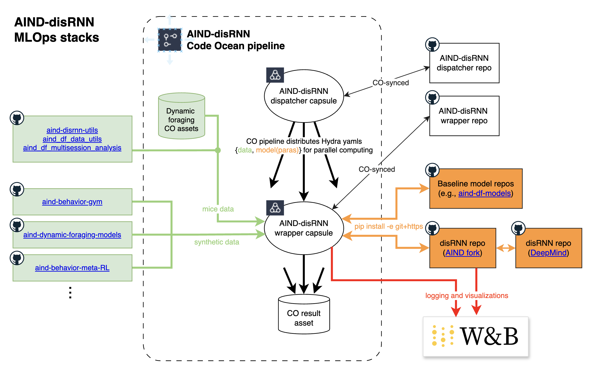

# aind-disrnn-result-access

[](LICENSE)

[](https://github.com/semantic-release/semantic-release)


This repo is part of the [aind-disrnn-pipeline](https://github.com/AllenNeuralDynamics/aind-disrnn-pipeline) project, providing post-hoc access to training results stored in W&B.



## Usage

This package provides a Python API for accessing disRNN training results
stored in Weights & Biases (W&B). Make sure you are authenticated with W&B
(`wandb login`) before using the client.

### Quick Start

```python
from aind_disrnn_result_access import WandbClient

# Initialize client (defaults to entity="AIND-disRNN")
client = WandbClient()

# List available projects
projects = client.get_projects()
# e.g. ["test", "han_mice_disrnn", "han_cpu_gpu_test"]
```

### Browse Run Metadata

```python
# List runs in a project
runs = client.get_runs(project="han_mice_disrnn")
for run in runs:
    print(run.name, run.state, run.summary.get("likelihood"))

# Filter runs (uses MongoDB-style queries)
finished = client.get_runs(
    project="han_mice_disrnn",
    filters={"state": "finished"},
)

# Control sorting and pagination
recent_runs = client.get_runs(
    project="han_mice_disrnn",
    order="-created_at",  # most recent first
    per_page=100,
)

# Get a specific run by ID
run = client.get_run("abc123", project="test")
print(run.config)   # training configuration
print(run.summary)  # final metrics
print(run.tags)     # run tags
```

### Get Runs as DataFrame

```python
# Get runs as a pandas DataFrame (similar to W&B web UI table)
# Config and summary values are flattened with dot notation
df = client.get_runs_dataframe(project="han_mice_disrnn")

# Filter and sort DataFrame
finished_df = df[df["state"] == "finished"]
best_runs = df.nlargest(5, "summary.likelihood")

# Access nested config values
print(df[["name", "config.model.lr", "summary.likelihood"]])
```

### Get Time-Series History

```python
# Get time-series metrics (e.g., train/loss over training steps)
history = client.get_run_history("abc123", project="test")
# Returns DataFrame with _step, _wall_time (elapsed seconds), and metrics
print(history[["_step", "_wall_time", "train/loss", "valid/loss"]])

# Get only specific metrics
history = client.get_run_history(
    "abc123",
    project="test",
    keys=["train/loss", "valid/loss"],
)

# Plot training curves vs wall time
history.plot(x="_wall_time", y=["train/loss", "valid/loss"])
```

### Download Artifacts

```python
# Download training outputs (params, plots, CSVs) for a single run
artifacts = client.download_artifact("abc123", project="test")
for art in artifacts:
    print(art.download_path)  # local path to downloaded files
    print(art.files)          # list of file names

# Download specific artifact type
artifacts = client.download_artifact(
    "abc123",
    project="test",
    artifact_type="training-output",
)

# Download only specific files from artifacts
artifacts = client.download_artifact(
    "abc123",
    project="test",
    files=["model_params.pkl", "training_curves.csv"],
)

# Batch download for multiple runs
all_artifacts = client.download_artifacts(
    ["run1", "run2", "run3"],
    project="han_mice_disrnn",
    output_dir="./my_artifacts",
)
```

### Set a Default Project

```python
# Avoid passing project= on every call
client = WandbClient(project="han_mice_disrnn")
runs = client.get_runs()  # uses default project
```

See `notebook/example_usage.ipynb` for a full interactive walkthrough.

## Level of Support
Please indicate a level of support:
 - [ ] Supported: We are releasing this code to the public as a tool we expect others to use. Issues are welcomed, and we expect to address them promptly; pull requests will be vetted by our staff before inclusion.
 - [ ] Occasional updates: We are planning on occasional updating this tool with no fixed schedule. Community involvement is encouraged through both issues and pull requests.
 - [ ] Unsupported: We are not currently supporting this code, but simply releasing it to the community AS IS but are not able to provide any guarantees of support. The community is welcome to submit issues, but you should not expect an active response.

## Release Status
GitHub's tags and Release features can be used to indicate a Release status.

 - Stable: v1.0.0 and above. Ready for production.
 - Beta:  v0.x.x or indicated in the tag. Ready for beta testers and early adopters.
 - Alpha: v0.x.x or indicated in the tag. Still in early development.

## Installation
To use the software, in the root directory, run
```bash
pip install -e .
```

To develop the code, run
```bash
pip install -e . --group dev
```
Note: --group flag is available only in pip versions >=25.1

Alternatively, if using `uv`, run
```bash
uv sync
```
